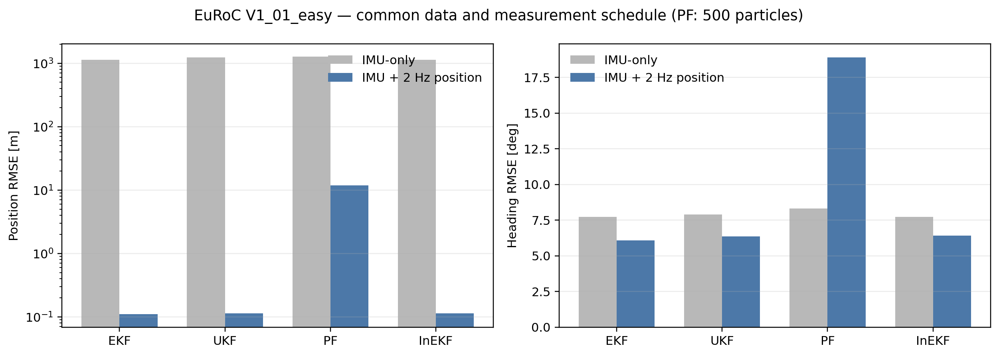
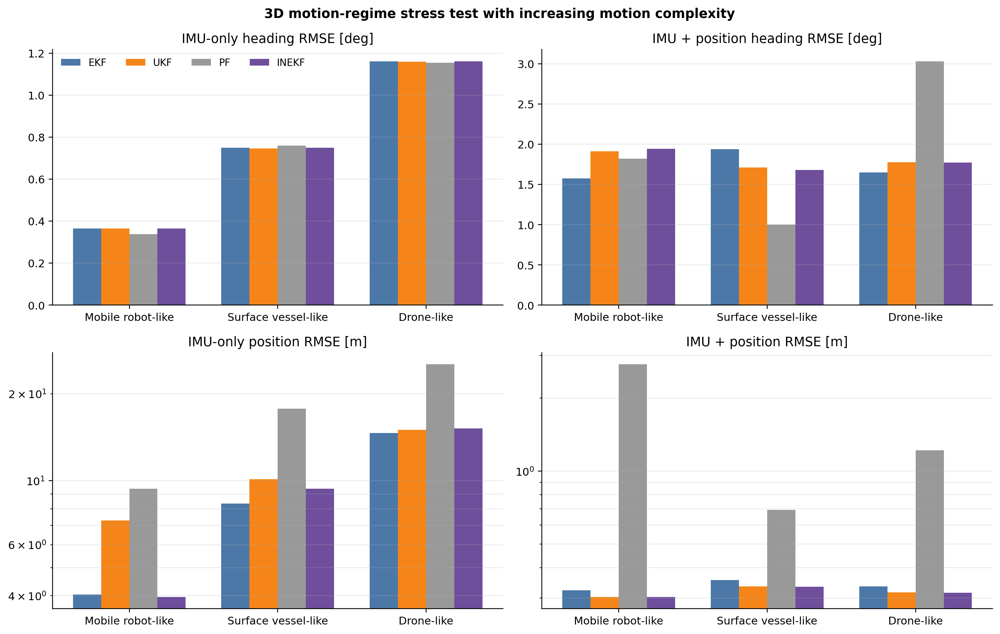
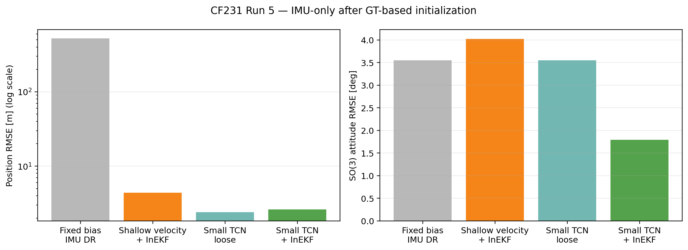

# 데이터셋별 결과와 해석

수치를 읽기 전에 실험 조건을 먼저 확인합니다.

## 1. 현재 결과 상태

| 데이터 | 실행 상태 | 공개 수치 | 제한 |
|---|---|---|---|
| EuRoC V1_01_easy | 전체 재실행 완료 | IMU-only, GT pseudo-position 2 Hz | 초기 state/bias는 GT |
| Synthetic 3D regimes | 재실행 가능 | 3개 motion regime | 실제 플랫폼 데이터가 아님 |
| CF231 Run 5 | held-out 재실행 완료 | fixed-bias DR, TCN, TCN+InEKF | Run 5 하나, GT-assisted initialization |
| i2Nav street00 | loader·config·원시 데이터 확보 | 아직 공개하지 않음 | 전체 필터 재실행 표 필요 |
| Pohang05 | loader·config 있음 | 아직 공개하지 않음 | baseline을 update/evaluation에 같이 쓰는 문제 |
| UrbanNav | 과거 수치만 있음 | 제거 | 현재 loader·설정·원 output 없음 |

## 2. EuRoC V1_01_easy

조건:

- 29,121개 IMU 중 5 sample마다 사용: 5,824 sample, 약 40 Hz
- 초기 `R,v,p,bg,ba`: EuRoC GT 첫 sample
- IMU-only: 초기화 후 update 0회
- fused: GT position에 표준편차 0.05 m의 random noise를 더해 2 Hz, 291회 update
- PF: 500 particles, seed 0

| 조건 | 필터 | 위치 RMSE [m] | 최종 위치 오차 [m] | Roll/Pitch/Yaw RMSE [deg] |
|---|---|---:|---:|---:|
| IMU-only | EKF | 1,131.871 | 2,887.884 | 8.411 / 2.659 / 7.727 |
| IMU-only | UKF | 1,227.416 | 3,208.488 | 8.537 / 2.712 / 7.900 |
| IMU-only | PF-500 | 1,265.223 | 3,259.081 | 8.624 / 2.714 / 8.314 |
| IMU-only | InEKF | 1,132.709 | 2,889.362 | 8.411 / 2.659 / 7.727 |
| GT pseudo-position | EKF | **0.1098** | 0.0469 | **3.042** / 0.790 / **6.089** |
| GT pseudo-position | UKF | 0.1140 | 0.0417 | 4.308 / 0.785 / 6.370 |
| GT pseudo-position | PF-500 | 11.9138 | 7.2440 | 8.368 / 4.420 / 18.908 |
| GT pseudo-position | InEKF | 0.1140 | **0.0416** | 4.367 / **0.784** / 6.425 |

해석:

- IMU-only에서 EKF와 InEKF 궤적이 거의 같은 이유는 nominal IMU propagation이 같고 update가 없기 때문입니다.
- 위치 측정을 넣으면 EKF/UKF/InEKF가 모두 0.11 m 수준이지만, 이 측정은 실제 GPS가 아니라 GT로 만든 pseudo-position입니다.
- SO(3) 자세 RMSE는 fused EKF 3.988°, UKF 3.458°, InEKF 3.461°였습니다. 축별 Euler 오차와 전체 회전 오차의 순위가 다를 수 있으므로 둘을 함께 봐야 합니다.

근거: [`results/data/euroc_results.csv`](results/data/euroc_results.csv), `config/euroc*.yaml`.

## 3. 3D motion-regime stress test

모든 regime에서 45 s, 50 Hz, 같은 IMU noise/bias random walk, fused의 경우 1 Hz position update를 사용합니다. mobile robot -> surface vessel -> drone 순서로 angular rate, roll/pitch, z motion, 궤적 주파수를 함께 늘립니다.

| regime | angular-rate RMS [rad/s] | InEKF IMU-only 위치 RMSE [m] | InEKF IMU-only yaw RMSE [deg] | InEKF fused 위치 RMSE [m] |
|---|---:|---:|---:|---:|
| Mobile robot-like | 0.312 | 3.961 | 0.365 | 0.303 |
| Surface vessel-like | 0.586 | 9.390 | 0.750 | 0.334 |
| Drone-like | 1.019 | 15.154 | 1.161 | 0.315 |

해석: 운동이 복잡해질수록 IMU-only drift는 커졌습니다. 하지만 fused 조건에서 InEKF가 EKF보다 항상 정확하지는 않았습니다.

근거: [`results/data/motion_regime_metrics.csv`](results/data/motion_regime_metrics.csv), `config/motion_regimes.yaml`.

## 4. CF231 Run 5

조건:

- training: Runs 3, 4, 9, 10
- gyro intrinsic/frame fit: Runs 3, 9, 10의 GT-derived angular velocity
- process-noise stationary variance: Runs 3, 9, 10의 초기 1 s IMU
- Run 5 fixed bias: Run 5의 검출된 초기 정지 구간; accelerometer bias의 gravity direction은 Run 5 초기 orientation 사용
- test: Run 5, 181.3 s, 18,149 samples
- Run 5 GT/reference: 초기 `R,v,p`와 accelerometer bias의 gravity direction, 전체 GT trajectory는 최종 scoring
- 초기화 이후 time-varying Run 5 GT: propagation, TCN inference, InEKF update에 사용하지 않음
- 초기화 후 runtime sensor: IMU
- Small TCN: 36,003 parameters, 200-sample causal window

| 방법 | 위치 RMSE [m] | 최종 위치 [m] | SO(3) RMSE [deg] | 최종 SO(3) [deg] |
|---|---:|---:|---:|---:|
| Fixed-bias IMU DR | 522.2007 | 1,005.4296 | 3.5535 | 8.7520 |
| Small TCN loose integration | **2.3955** | **2.8399** | 3.5535 | 8.7520 |
| Small TCN + InEKF velocity update | 2.6131 | 3.2410 | **1.7964** | **0.4605** |

Fixed-bias DR의 horizon error:

| 시간 | 위치 오차 [m] | SO(3) 오차 [deg] |
|---:|---:|---:|
| 1 s | 0.002 | 0.161 |
| 5 s | 0.140 | 0.411 |
| 10 s | 0.841 | 1.705 |
| 20 s | 7.165 | 0.750 |
| 60 s | 70.423 | 1.490 |
| 120 s | 601.255 | 0.730 |

해석:

- 초기 bias를 고정해도 가속도 잔차가 두 번 적분되어 장기 위치가 크게 발산합니다.
- TCN 속도를 바로 적분한 방법이 위치 RMSE는 가장 낮습니다.
- 같은 속도를 InEKF update에 넣으면 위치 RMSE는 9.1% 높지만 SO(3) RMSE와 최종 자세 오차가 줄었습니다. 현재 결과에서 InEKF 결합의 이점은 자세 교정입니다.

근거: [`results/data/cf231_run5_summary.json`](results/data/cf231_run5_summary.json), [`results/data/cf231_learned.csv`](results/data/cf231_learned.csv).
